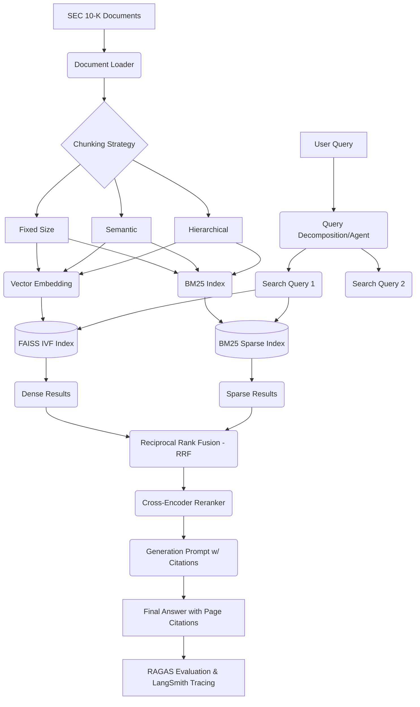

# Production RAG System with Evaluation Framework
"Enterprise Q&A that you can actually measure and improve"

## Overview
This project constructs a production-grade Retrieval-Augmented Generation (RAG) system specialized for exploring and analyzing SEC 10-K financial filings. It emphasizes deep practical understanding of retrieval mathematics, robust generation with strict citations, quantitative evaluation, and agentic query decomposition.

## Technologies Used
- **LangChain** (LCEL, Chains, Document Loaders)
- **FAISS** (Vector Database, IVF/HNSW indices)
- **Sentence-Transformers** (Bi-encoders/Cross-encoders)
- **RAGAS** (Automated RAG evaluation)
- **LangSmith** (Observability and tracing)
- **BM25 / Rank-BM25** (Sparse retrieval)
- **PyTorch** & **Transformers** (Model backends)

## Project Architecture



## Step-by-Step Implementation Guide

### Part A: Retrieval Deep Dive

#### 1. Setup Data Processing and Chunking
1. **Data Loading**: Load SEC 10-K PDFs using `PyPDFLoader` to retain metadata (page numbers and document source are critical for Part B).
2. **Chunking Strategies**:
   - **Fixed-size**: Divide text into 1000-character chunks with a 200-character overlap.
   - **Sentence-level**: Chunk by sentence boundaries using NLTK or Spacy.
   - **Semantic chunking**: Splitting text when the underlying meaning shifts, calculated via cosine similarity drops between sequential sentences.
   - **Hierarchical chunking**: Parent-child document retrieval stores large parent chunks for complete context and small child chunks for vector searching.

#### 2. Vector Stores & Dense Retrieval
1. **Embedding Models**: Use `sentence-transformers/all-MiniLM-L6-v2` (Bi-encoder) to map text to dense numerical vectors. 
2. **FAISS IVF**: Implement a FAISS Index (IndexIVFFlat) to enable clustering. It partitions the vector space using k-means, avoiding exhaustively calculating the dot product across 100,000+ chunks.

#### 3. Sparse Retrieval (BM25)
1. **TF-IDF for Retrieval**: Use `Rank-BM25` to evaluate exact keyword overlap. Unlike dense retrieval which excels at semantic similarity, BM25 handles specific financial entities, product names, or ticker symbols.

#### 4. Hybrid Search and Reranking
1. **Reciprocal Rank Fusion (RRF)**: Implement RRF formula `score = 1 / (k + rank)` to effectively combine BM25 sparse rankings with FAISS dense rankings without requiring normalized prediction scores.
2. **Cross-Encoder Reranking**: Send the top `N` candidates from the RRF output to a Cross-Encoder (`cross-encoder/ms-marco-MiniLM-L-6-v2`). Why? Bi-encoders compute query and document separately; Cross-encoders process them simultaneously, yielding highly accurate relevance scores at the expense of computational latency.

### Part B: Generation + Citation

#### 1. Prompt Engineering
1. **System Role**: Establish a hardline persona. Example: "You are a senior financial analyst. Answer inquiries leveraging ONLY the retrieved context."
2. **Chain-of-Thought (CoT)**: Restructure the prompt to force step-by-step reasoning before final articulation.

#### 2. Strict Citation Enforcement
1. **Page/Source Linking**: Inject metadata (e.g., `[AAPL_10k.pdf, Page 45]`) into the retrieved text block sent to the LLM. Instruct the model to append these exact bracketed identifiers next to any factual premise made in the answer.

#### 3. Hallucination Detection
1. **Self-Consistency Implementation**: Generate 3 responses concurrently with a temperature of 0.4. If there is significant deviation between the facts cited, an automated "hallucination flag" is raised to notify the end-user.

### Part C: RAG Evaluation Framework (CI/CD Integrated)

#### 1. Building the Eval Dataset
Generate a golden dataset comprising 50 tuples: `(User Query, Annotated Ground-Truth, Source Document)`. Question types must span: Extracting metrics, analyzing trends, and summarizing risk factors.

#### 2. RAGAS Metrics
Compute performance quantitatively:
- **Faithfulness**: Do the retrieved passages actually corroborate the generated answer?
- **Answer Relevancy**: Does the answer directly tackle the posed question?
- **Context Precision**: Are the most relevant chunks bubbled up to the absolute top of the reranker?
- **Context Recall**: Did the retrieval system find all necessary information fragments?

#### 3. CI/CD Gate via GitHub Actions
Create an automated test suite. On every Pull Request, trigger the eval dataset inference run. The pipeline is programmed to execute `exit 1` (fail the build) if the system's overall **Faithfulness metric falls below 0.75**.

#### 4. Observability
Instrument all LangChain execution blocks with **LangSmith**. Ensure `LANGCHAIN_TRACING_V2=true` is set to monitor pipeline latency, LLM trace steps, and pinpoint bottlenecks.

### Part D: Agentic Multi-Hop RAG

#### 1. Query Decomposition
Introduce an LLM router at the gateway. For compound questions (e.g., "How does Microsoft's AI spending compare to Google's?"), the agent decomposes this into:
- Q1: "What was Microsoft's AI spending?"
- Q2: "What was Google's AI spending?"

#### 2. Synthesis and Multi-hop Reasoning
Conduct the hybrid retrieval pipeline on both sub-queries in parallel. Funnel both isolated answers into a final Synthesizer Node that drafts the comparative response.

## Running Locally

### 1. Requirements
Ensure Python 3.10+ is installed.
```bash
pip install -r requirements.txt
```

### 2. Environment Variables
Create a `.env` root file:
```txt
OPENAI_API_KEY=sk-...
LANGCHAIN_API_KEY=lsv2_...
LANGCHAIN_TRACING_V2=true
LANGCHAIN_PROJECT=sec-qa-production
```

### 3. Usage
- **Build Vector & BM25 Indexes**: `python src/ingest_sec_data.py`
- **Start Inference API**: `python src/agent_router.py`
- **Run Tests & RAGAS Eval**: `pytest tests/test_ragas_eval.py`
